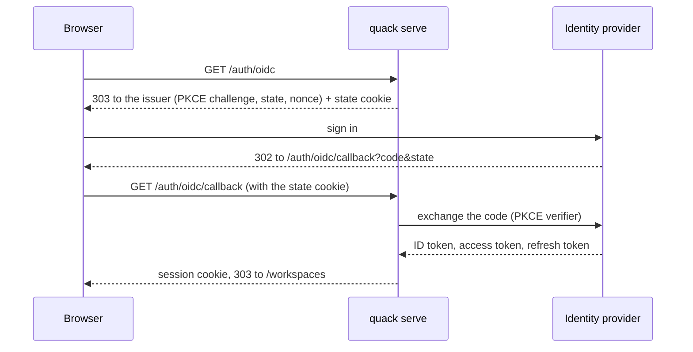

# Authentication

quack authenticates in two directions:

- **Into quack.** People and programs prove who they are to `quack serve`: a browser, a
  script calling the REST API, an MCP client.
- **Out of quack.** quack proves who it is to the model providers it calls (an
  OpenAI-compatible gateway, Azure OpenAI, Anthropic, Bedrock).

The two are configured separately: `[server]` and `[server.oidc]` for the first,
`[providers.NAME]` for the second. They can share an identity provider, but nothing requires
it. This page describes what each mode does, what it stores, and how to set it up. Design doc
sections 10.2 and 12 hold the rationale; [`crypto.md`](crypto.md) covers the cryptography.

| Direction | Mode | Credential | Configured by |
|---|---|---|---|
| In | Local | none (loopback only) | `quack serve --local` or `[server].local` |
| In | Password | session cookie or `qs_…` bearer | `quack user add` |
| In | API token | `qk_…` bearer, one workspace | `quack token create` |
| In | OpenID Connect sign-in | session cookie | `[server.oidc]` |
| In | Identity-provider access token | JWT bearer | `[server.oidc].audience` |
| Out | None | nothing | `auth = "none"` |
| Out | API key | static bearer from an environment variable | `auth = "api-key"` |
| Out | OAuth | access token from an identity provider | `auth = "oauth"` + `[providers.NAME.oauth]` |
| Out | AWS | SigV4 from the AWS SDK credential chain | `type = "bedrock"` / `"bedrock-mantle"` |

## Into quack

### Which interfaces authenticate

Only `quack serve` does. The terminal session, print mode (`-p`, `-q`), `quack ingest`, and
`quack mcp` on stdio run as whoever runs them: anyone who can run the binary against the data
directory can read it, so the directory is created `0700` and `quack doctor` warns when it is
not. Those interfaces are not audited in `control.db`.

`quack serve --local` (or `[server].local = true`) turns authentication off: one implicit
owner of everything, and the server refuses to bind anything but a loopback address. It is for
one person on a laptop who wants the browser.

### How `quack serve` decides who is calling

Every request on the API, MCP, and the web UI goes through one extractor (`server::auth`).
It takes the bearer from `Authorization: Bearer …`, or else the `quack_session` cookie, and
tries, in order:

1. **A session** (`qs_…`), from a password login or an OpenID Connect sign-in.
2. **An identity-provider access token**, when `[server.oidc].audience` is set and the bearer
   is shaped like a JWT.
3. **An API token** (`qk_…`).

A request that matches none of them gets `401`. When quack is a protected resource (below),
that 401 also says where to get a token. Web pages redirect to `/login` instead of answering
401.

What the caller may then do in a workspace is decided by membership, not by how they
authenticated: `viewer`, `member`, or `owner` per workspace, plus the server-wide admin flag,
which grants settings and membership but never workspace content. An API token is further
limited to its one workspace and its scopes. Every request that touches a workspace writes an
access row to `control.db`'s `audit_log`, denied ones included, and a detail row inside the
workspace (design doc 12).

### Passwords and sessions

```bash
quack user add alice            # prompts for the password (reads stdin when it is not a terminal)
quack user add admin --admin
```

Passwords are hashed with argon2id. The web form (`POST /login`) and the API
(`POST /api/v1/auth/login`) both check them and open a session. The session token is
`qs_` plus 32 random bytes. It is held in memory only, so a restart signs everyone out.

- **Cookie.** `HttpOnly`, `SameSite=Lax`, `Path=/`, and `Secure` unless the request came from
  loopback.
- **Lifetime.** A session ends `[server].session_max_age_hours` (12) after login however much
  it is used, or `[server].session_idle_minutes` (120) after its last request, whichever comes
  first.
- **Rate limit.** Both login routes allow 2 requests per second per client, bursting to 10,
  on top of the server-wide limit.
- **Logout.** `POST /logout` (web) or `POST /api/v1/auth/logout`.

### API tokens

```bash
quack token create -w sales --user alice --name reporting --scopes read,write --expires 90
quack token list -w sales
quack token revoke -w sales HASH
```

A token is `qk_` plus 32 random bytes, shown once. `control.db` keeps only its SHA-256. It
belongs to one workspace, acts as its user, and carries scopes: `read`, `write`, and `admin`.
An expired or revoked token is refused and audited. Workspace owners can also create and
revoke tokens on the workspace's Settings page.

### Sign-in through your identity provider

With `[server.oidc]` set, the login page offers "Sign in with *issuer host*" above the
password form. Password login keeps working beside it.

```toml
[server.oidc]
issuer_url = "https://login.example.com"                      # its /.well-known/openid-configuration is read
client_id = "quack"
client_secret_env = "QUACK_OIDC_SECRET"                       # when the issuer registers quack as a confidential client
redirect_uri = "https://quack.example.com/auth/oidc/callback" # this server's URL; register it with the issuer
# scopes = ["openid", "profile", "email", "offline_access"]   # the default; "openid" is required
# subject_claim = "sub"                                       # "oid" for Entra
```



- **Checks.** The callback's `state` must match the cookie the same browser received when it
  left, so a callback someone else started cannot sign this browser in. The pending sign-in
  expires after ten minutes, and each `state` can be used once. The ID token comes straight
  from the token endpoint over TLS, which OpenID Connect Core 3.1.3.7 accepts in place of a
  signature check. quack checks its `iss` (which must also match the discovery document),
  `aud`, `azp`, `exp` (a minute's leeway), and the `nonce` it sent.
- **Who.** The person is the `subject_claim` claim, `sub` by default. Entra gives the same
  person a different `sub` in each application, so Entra deployments set `oid`.
- **First sign-in.** The first sign-in creates a user with no password, no admin flag, and no
  workspace memberships: they see nothing until an owner adds them. The username is
  `preferred_username`, else `email`, else the subject. If another user already has that
  name, the new user gets it with a suffix, so a sign-in never takes over an existing account
  by name.
- **Staying signed in.** The refresh token is kept, sealed, in `control.db`. When the access
  token runs out, the next request renews it. If the issuer refuses the renewal (the account
  was disabled or the grant revoked), every session the user has ends. If the issuer cannot be
  reached, quack tries again a minute later and the session carries on. Without a refresh
  token (no `offline_access`), a sign-in lasts until quack's own session limits.
- **Logout.** Logging out of the user's last session deletes the stored token.
- **Audit.** Both outcomes are audited as `login`; an ended sign-in as a denied `session`.

### Identity-provider access tokens (quack as a protected resource)

Set `audience`, and the API and MCP also accept access tokens your identity provider issues
for quack. A client that already holds one, a script or an MCP client like Claude Code, uses
it directly: no quack API token to create and hand out.

```toml
[server.oidc]
# ...as above
audience = "api://quack"   # the aud of access tokens for quack; see the provider notes below
```

- **Verification.** Tokens are verified with `jsonwebtoken` on aws-lc-rs, against the keys at
  the issuer's `jwks_uri`. Keys are cached for an hour and fetched again for an unknown `kid`
  at most once a minute, which covers key rotation without letting bad tokens flood the
  issuer. Only asymmetric algorithms are accepted. `iss` must be the issuer, `aud` the
  configured audience, and `exp` in the future (a minute's leeway).
- **Access tokens only.** The token must carry a `scp` or `scope` claim. An ID token can have
  the same `aud` as an access token but carries no scope, so it is refused.
- **Who.** The token names its user through `subject_claim`, the same as a sign-in, so a
  person is one quack user whichever way they arrive. A new person is created with no access,
  and the token carries that user's own memberships.
- **Refusals.** A refused token gets `401` and is audited as a denied `token`.

quack publishes where to get such a token (RFC 9728), and a `401` points to it:

| Path | Describes |
|---|---|
| `/.well-known/oauth-protected-resource` | the server |
| `/.well-known/oauth-protected-resource/api/v1` | the REST API |
| `/.well-known/oauth-protected-resource/mcp/v1/{workspace}` | one MCP endpoint |

```http
HTTP/1.1 401 Unauthorized
WWW-Authenticate: Bearer resource_metadata="https://quack.example.com/.well-known/oauth-protected-resource/mcp/v1/sales"
```

Each document names the issuer in `authorization_servers`. When a presented credential was
refused, the challenge adds `error="invalid_token"`. This is the discovery the MCP
authorization specification expects: an MCP client pointed at
`https://quack.example.com/mcp/v1/sales` with no token reads the metadata, signs the user in
with the issuer, and retries with the access token. Without `audience`, none of this is
published and a JWT bearer is treated as an unknown API token.

## Out of quack: model providers

Each `[providers.NAME]` has an `auth` mode. Every interface uses the same provider
credentials; a provider's identity is quack's, not the caller's (see [Planned](#planned)).

### None and API keys

```toml
[providers.ollama]
type = "ollama"                 # auth = "none" is the default

[providers.anthropic]
type = "anthropic"
auth = "api-key"
api_key_env = "ANTHROPIC_API_KEY"
```

An API key is read from the named environment variable and sent as the bearer. quack stores
nothing.

### OAuth

For endpoints behind an identity provider (Azure OpenAI with Entra, an internal gateway),
quack obtains an access token and sends it as the bearer. The `grant` decides how.

| `grant` | Who | Renewal |
|---|---|---|
| `authorization-code` (default) | A person signs in through the browser: PKCE, and a loopback listener on `redirect_uri` catches the redirect. | The refresh token, silently. |
| `device-code` | A person enters a code on another device (SSH, no browser). | The refresh token, silently. |
| `client-credentials` | quack itself, with `client_id` and the secret in `client_secret_env`. Nobody signs in. | The grant runs again. |

```toml
[providers.azure]
type = "openai"
base_url = "https://{resource}.openai.azure.com/openai/deployments/{deployment}"
auth = "oauth"

[providers.azure.oauth]
issuer_url = "https://login.microsoftonline.com/{tenant_id}/v2.0"
client_id = "..."
scopes = ["https://cognitiveservices.azure.com/.default", "offline_access"]
# grant = "authorization-code"                  # or "device-code", "client-credentials"
# client_secret_env = "AZURE_CLIENT_SECRET"      # required for client-credentials
# redirect_uri = "http://127.0.0.1:19876/callback"
```

```bash
quack auth login azure      # browser, or a device code when no browser can open; --device-code forces it
quack auth status           # every OAuth provider: token expiry, how it renews, where the key is
quack auth logout azure
```

- **Reuse and renewal.** A token is reused while more than a minute remains, then renewed
  under one lock, so concurrent requests share one refresh.
- **When no one can log in.** If a person must sign in and cannot (a server, print mode),
  the command fails with "needs a login; run `quack auth login NAME`": exit code 4 from the
  CLI, `503` from the server.
- **Client credentials.** A `client-credentials` provider needs no login: the first request
  obtains a token. A refused secret is reported as an error, not as a login prompt.
  `quack auth login` on such a provider checks the credentials once.
- **Where it lives.** The token is sealed in `control.db` (`provider_tokens`), so a login in
  one terminal serves every later process on the same data directory, including
  `quack serve`.

### AWS (Bedrock)

`bedrock` and `bedrock-mantle` providers use the AWS SDK's default credential chain, the one
the AWS CLI uses:
- environment variables;
- the profile in `aws_profile` (else `AWS_PROFILE`, else `default`), including
  `role_arn`/`source_profile`, `credential_process`, and IAM Identity Center
  (`aws sso login`);
- EKS web identity;
- ECS and EC2 instance roles.

quack stores nothing; the SDK caches and refreshes. Design doc 10.2 has the details.

## Where secrets are kept

| What | Where | Protected by |
|---|---|---|
| The vault key (HPKE, P-256) | OS keychain entry `quack` / `vault`; else `<data_dir>/vault.key` | the keychain, or file mode `0600` |
| Signed-in users' identity-provider tokens | `control.db`, `user_tokens` (deleted with the user) | sealed by the vault |
| Providers' OAuth tokens | `control.db`, `provider_tokens` | sealed by the vault |
| Passwords | `control.db`, `users.password_hash` | argon2id |
| API tokens | `control.db`, `api_tokens.token_hash` | SHA-256 of a 32-byte random token |
| Sessions | memory only | lost on restart |
| Client secrets, API keys | environment variables named in the config | the environment |
| AWS credentials | the AWS SDK's own locations | the SDK |

The vault seals with HPKE (RFC 9180: DHKEM(P-256, HKDF-SHA256), HKDF-SHA256, AES-256-GCM).
Each value is bound to its purpose and its owner, so a sealed row copied to another user or
provider does not open. The key never sits in the database it protects.

- **Linux keychain.** The kernel keyring is memory only, so after a reboot the vault key is
  gone: users sign in again and providers need `quack auth login` again.
- **Containers.** Docker's default seccomp profile blocks the keyring entirely, so the key
  goes in `vault.key` on the data volume.
- **Backups.** A backup of `control.db` without the key cannot open the tokens in it, which
  is the point. Restore the key with it, or expect everyone to sign in again.

## Provider notes

These are the settings each issuer needs, from its documentation as of September 2026. None
has been tried against a live tenant yet.

**Microsoft Entra ID**
- `issuer_url = "https://login.microsoftonline.com/{tenant_id}/v2.0"`.
- Register `https://<server>/auth/oidc/callback` as a Web redirect URI, and create a client
  secret for `client_secret_env`.
- Set `subject_claim = "oid"`: Entra's `sub` is different in every application.
- To accept access tokens:
  - Expose an API on the app registration.
  - Set `requestedAccessTokenVersion` to `2` in its manifest (older manifests call it
    `accessTokenAcceptedVersion`). Otherwise the tokens are v1.0 and carry the
    `https://sts.windows.net/{tenant_id}/` issuer, which does not match.
  - Set `audience` to the API's **client ID** (a GUID). In v2.0 tokens, `aud` is always the
    client ID, never the Application ID URI.
- Entra access tokens carry `scp`.

**Okta**
- Use a custom authorization server: `issuer_url = "https://{domain}/oauth2/default"` (or
  your server's ID). The org authorization server does not issue access tokens for your own
  APIs.
- Enable the Refresh Token grant on the app for `offline_access`.
- Set `audience` to the authorization server's Audience (for `default`, `api://default`).
- Okta access tokens carry `scp` as an array.

**Auth0**
- `issuer_url = "https://{tenant}.auth0.com/"`, or your custom domain.
- Set `audience` to the API's Identifier.
- Enable "Allow Offline Access" on the API for refresh tokens.
- Auth0 issues a JWT access token only when the client asks for an audience. quack's own
  sign-in cannot ask for one yet, but clients that obtain tokens themselves, such as MCP
  clients, can use their tokens with quack.

**Vouch** ([vouch.sh](https://vouch.sh))
- Vouch binds every token to the client's key with DPoP, which quack does not support yet
  (#216).
- It offers only the `openid` and `email` scopes, so set `scopes = ["openid", "email"]`.
- It issues no refresh tokens, so a sign-in lasts as long as Vouch's session.

## Troubleshooting

- **`quack doctor`** checks each configured piece:
  - every model provider (reachable, credential accepted, model listed);
  - `[server.oidc]`: the secret variable is set, the issuer answers discovery under its
    configured name, and, with `audience`, how many signing keys it publishes.

  `--offline` skips the network.
- **`quack config`** lists every setting in force and where it came from, including
  `[server.oidc]`.
- **"provider 'X' needs a login"** (exit 4, or `503` from the server): run
  `quack auth login X` as the user the server runs as, on the same data directory.
- **`access token refused: InvalidAudience`**: the token's `aud` is not `[server.oidc].audience`.
  Decode the token (it is a JWT) and compare. For Entra, see the client ID note above.
- **"the discovery document names issuer …, not …"**: `issuer_url` must match the issuer's
  own `issuer` value exactly, apart from a trailing slash.
- **"the sign-in could not be matched to this browser"**: the state cookie was missing. The
  sign-in started in another browser or tab, or the redirect URI's host differs from the one
  the browser used, so the cookie was not sent.

## Planned

- **On-behalf-of (#211).** Today every user's requests reach a model provider as quack's one
  identity for that provider. #211 exchanges the signed-in user's token, or the access token
  a client presented, for a token to the model API, so the provider sees each user:
  - Entra's On-Behalf-Of flow;
  - RFC 8693 token exchange for Okta, Auth0, and Vouch.
- **DPoP (#216).** Sender-constrained tokens, which Vouch requires.
