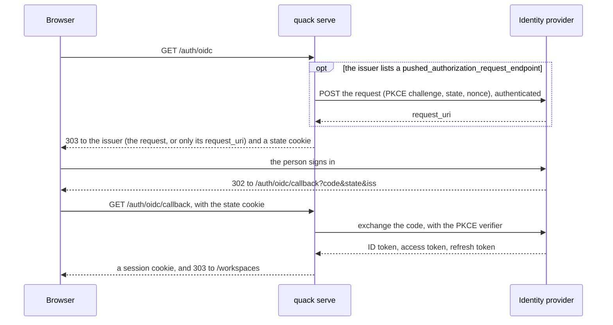

# Authentication

This document explains how quack proves identity in two directions. Inbound, people and
programs prove to `quack serve` who they are. Outbound, quack proves to each model provider
who is calling: quack itself, or the person who made the request. An operator configures
the two directions separately. `[server]` and `[server.oidc]` control inbound
authentication, and `[providers.NAME]` controls outbound. The two directions can share one
identity provider, but neither requires the other.

Design doc sections 10.2 and 12 record why quack works this way. [`crypto.md`](crypto.md)
covers the cryptography.

## Terms

| Term | Meaning |
|---|---|
| Identity provider, issuer | The organization's sign-in service, such as Microsoft Entra ID, Okta, or Auth0. It issues tokens. |
| OAuth 2.0 | The standard protocol for issuing access tokens. |
| OpenID Connect (OIDC) | A sign-in layer on OAuth 2.0 that adds the ID token. |
| Access token | A short-lived credential that lets its holder call an API (application programming interface). |
| ID token | A signed statement of who signed in, for the application the person signed in to. |
| Refresh token | A longer-lived credential that obtains new access tokens without a new sign-in. |
| Bearer | A token sent in the HTTP (Hypertext Transfer Protocol) `Authorization: Bearer` header; whoever holds it can use it. |
| JWT (JSON Web Token) | A signed token format with readable claims such as `iss` (issuer), `sub` (subject), `aud` (audience), and `exp` (expiry). |
| JWKS (JSON Web Key Set) | The public keys an issuer publishes at its `jwks_uri` so others can check its JWT signatures. |
| PKCE (Proof Key for Code Exchange) | A secret the client proves at the token endpoint, so a stolen sign-in code is useless. |
| PAR (Pushed Authorization Request) | The client sends its sign-in request straight to the issuer and the browser carries only a reference to it (RFC 9126). |
| Client assertion, `private_key_jwt` | A short-lived JWT the client signs with its own private key to authenticate at the token endpoint, in place of a shared secret (RFC 7523). |
| OBO (on behalf of) | quack exchanges a signed-in person's token for a token to a model provider, so the provider sees the person rather than quack. |
| MCP (Model Context Protocol) | The protocol that AI clients such as Claude Code use to call tools; quack serves it at `/mcp/v1/{workspace}`. |
| RFC (Request for Comments) | A standard from the Internet Engineering Task Force, cited here by number. |
| HPKE (Hybrid Public Key Encryption) | The encryption scheme the vault uses for stored tokens (RFC 9180). |
| DPoP (Demonstrating Proof of Possession) | A scheme that binds a token to a key its client holds (RFC 9449). |
| SigV4 | The AWS (Amazon Web Services) request-signing scheme. |

| Direction | Mode | What the caller presents | How to turn it on |
|---|---|---|---|
| Inbound | Local | nothing (loopback only) | `quack serve --local`, or `[server].local = true` |
| Inbound | Password | a session cookie, or a `qs_…` bearer | `quack user add` |
| Inbound | API token | a `qk_…` bearer for one workspace | `quack token create` |
| Inbound | OpenID Connect sign-in | a session cookie | `[server.oidc]` |
| Inbound | Identity-provider access token | a JWT bearer | `[server.oidc].audience` |
| Outbound | None | nothing | `auth = "none"` (the default) |
| Outbound | API key | a static bearer from an environment variable | `auth = "api-key"` |
| Outbound | OAuth as quack | an access token quack obtains for itself | `auth = "oauth"` with a `grant` other than `on-behalf-of` |
| Outbound | OAuth on behalf of the person | an access token issued for the person who made the request | `grant = "on-behalf-of"` |
| Outbound | AWS | a SigV4 signature from the AWS credential chain | `type = "bedrock"` or `"bedrock-mantle"` |

## Inbound: proving identity to quack

### Which interfaces authenticate

Only `quack serve` authenticates callers. The terminal session, print mode (`-p` and `-q`),
`quack ingest`, and `quack mcp` on stdio run as the operating-system user who starts them.
Anyone who can run the binary against a data directory can read everything in it. quack
therefore creates that directory with mode `0700`, and `quack doctor` warns when other users
can read it. `control.db` does not audit these interfaces.

`quack serve --local` turns authentication off. One implicit owner holds every workspace,
and the server refuses to bind any address other than loopback. This mode serves one person
who wants the browser on their own machine.

### How `quack serve` decides who is calling

One extractor, `server::auth`, handles every request to the REST API, the MCP endpoint, and
the web user interface (UI). It reads the bearer from the `Authorization: Bearer` header, or
else the `quack_session` cookie, and tries three kinds of credential in this order:

1. A session (`qs_…`), which a password login or an OpenID Connect sign-in opened.
2. An identity-provider access token, when `[server.oidc].audience` is set and the bearer
   has the three dot-separated parts of a JWT.
3. An API token (`qk_…`).

A request that matches none of them receives `401`. When quack acts as a protected resource
(described below), that `401` also tells the client where to obtain a token. Web pages
redirect to `/login` instead of returning `401`.

Workspace membership, not the kind of credential, decides what an authenticated caller may
do. Each member holds one role per workspace: `viewer`, `member`, or `owner`. The
server-wide admin flag lets a user manage users, workspaces, and membership, but it never
grants access to workspace content. An API token also carries scopes (`read`, `write`,
`admin`) and works in one workspace only. Every request that touches a workspace, including
a denied one, writes an access row to `control.db`'s `audit_log` and a detail row inside
that workspace's own file (design doc 12).

### Passwords and sessions

```bash
quack user add alice            # prompts for the password; reads stdin when it is not a terminal
quack user add admin --admin
```

quack hashes passwords with argon2id, a password-hashing function built to resist guessing.
The web form (`POST /login`) and the API (`POST /api/v1/auth/login`) both check the password
and open a session. A session token is `qs_` followed by 32 random bytes. quack holds
sessions in memory only, so a restart signs every user out.

The session cookie carries `HttpOnly`, `SameSite=Lax`, and `Path=/`. It also carries
`Secure` unless the request arrived from loopback. A TLS-terminating proxy on the same host
also connects over loopback, so on loopback the cookie still carries `Secure` when
`[server.oidc].redirect_uri` is an https URL, or when `[server].secure_cookies = "always"`
(the default is `"auto"`). Set `"always"` behind a same-host proxy that serves https
without `[server.oidc]`. quack never reads `X-Forwarded-Proto` for this, since any client
can send it. The sign-in state cookie of `[server.oidc]` follows the same rule. A session ends 12 hours after login
(`[server].session_max_age_hours`) or 120 minutes after its last request
(`[server].session_idle_minutes`), whichever comes first. The two login routes accept 2
requests per second from one peer address, with bursts of up to 10, in addition to the
server-wide rate limit, which is also per address. Neither limit looks at the
`Authorization` header, so a client cannot buy a fresh budget by changing it. `POST /logout` (web) and `POST /api/v1/auth/logout` (API) end a
session.

### API tokens

```bash
quack token create -w sales --user alice --name reporting --scopes read,write --expires 90
quack token list -w sales
quack token revoke -w sales HASH          # a prefix of the hash is enough
```

An API token is `qk_` followed by 32 random bytes. quack shows it once and stores only its
SHA-256 hash. The token acts as its user in one workspace, limited to its scopes. quack
refuses and audits an expired or revoked token. Workspace owners can also create and revoke
tokens on the workspace's Settings page.

### Sign-in through the organization's identity provider

With `[server.oidc]` set, the login page offers "Sign in with *issuer host*" above the
password form. Password login continues to work beside it.

```toml
[server.oidc]
issuer_url = "https://login.example.com"                      # quack reads its /.well-known/openid-configuration
client_id = "quack"
client_secret_env = "QUACK_OIDC_SECRET"                       # when the issuer registers quack as a confidential client
# client_auth = "private_key_jwt"                             # sign with quack's own key; no secret
redirect_uri = "https://quack.example.com/auth/oidc/callback" # this server's own URL; register it with the issuer
# scopes = ["openid", "profile", "email", "offline_access"]   # the default; "openid" is required
# subject_claim = "sub"                                       # set "oid" for Entra ID
```



When the issuer's discovery document lists a `pushed_authorization_request_endpoint`, quack
pushes the sign-in request there first, as RFC 9126 describes, and authenticates the push
the same way it authenticates at the token endpoint. The browser then carries only
`client_id` and the `request_uri` the issuer returned, so no one can read or alter the PKCE
challenge, the `state`, the `nonce`, or the redirect on the way. Without that endpoint the
browser carries the request itself, as before. quack does the same for a provider's
`authorization-code` login.

The callback must come from the browser that started the sign-in. quack compares the
callback's `state` with a cookie it set on that browser when the sign-in began. A callback
link that someone else started therefore cannot sign this browser in. A pending sign-in
expires after 10 minutes, quack accepts each `state` once, and quack holds at most 10,000
pending sign-ins at a time. When the redirect names an issuer in its `iss` parameter, that
issuer must be the configured one; an issuer that advertises
`authorization_response_iss_parameter_supported` must always send it (RFC 9207). This check
stops a response from one server from passing as another's.

The ID token arrives from the token endpoint over TLS (Transport Layer Security). OpenID
Connect Core 3.1.3.7 accepts that channel in place of a signature check. quack checks four
claims instead. `iss` must match the discovery document. `aud` and `azp` must name quack's
client. `exp` must not have passed, with 60 seconds of leeway. `nonce` must equal the value
quack sent.

The claim named by `subject_claim` identifies the person. The default is `sub`. Entra ID
gives one person a different `sub` in every application, so Entra deployments set `oid`.
The first sign-in creates a user with no password, no admin flag, and no workspace
memberships; the new user sees nothing until an owner adds them. quack takes the username
from `preferred_username`, then `email`, then the subject. If another user already holds
that name, the new user receives it with a suffix, so a sign-in never takes over an existing
account by name.

quack keeps the person's tokens, including the refresh token, sealed in `control.db`. When
the access token nears expiry, the person's next request renews it. If the issuer refuses
the renewal, because it revoked the grant or disabled the account, every session the person
holds ends. If the issuer cannot be reached, quack retries 60 seconds later and the session
continues meanwhile. An issuer that returns no refresh token (no `offline_access`) leaves
the session to quack's own 12-hour and 120-minute limits. Logging out of a person's last
session deletes their stored tokens. `control.db`'s audit log records every sign-in as
`login`, and every sign-in the issuer ended as a denied `session`.

### Access tokens from the identity provider (quack as a protected resource)

When `audience` is set, the API and MCP also accept access tokens that the identity provider
issues for quack. A script or an MCP client such as Claude Code can then use a token it
already holds, and no one creates or hands out a quack API token.

```toml
[server.oidc]
# ...as above
audience = "api://quack"   # the aud of access tokens for quack; see the provider notes
```

quack verifies each token with `jsonwebtoken` on aws-lc-rs, against the keys published at
the issuer's `jwks_uri`. It caches those keys for one hour. A token signed with an unknown
key causes one fetch, at most once a minute, which covers key rotation without letting
invalid tokens flood the issuer. quack accepts asymmetric signature algorithms only. It
requires `iss` to be the issuer and `aud` to be the configured audience. `exp` must be in
the future, with 60 seconds of leeway. The token must also carry a `scp` or `scope` claim.
An ID token can carry the same `aud` as an access token but carries no scope, so this rule
refuses ID tokens.

The token identifies its user through `subject_claim`, as a sign-in does. One person
therefore maps to one quack user however they arrive. quack creates a person it has not seen
before with no access, and the token then carries that user's own memberships. quack answers
a refused token with `401` and audits it as a denied `token`.

quack publishes where to obtain such a token, as OAuth 2.0 Protected Resource Metadata
(RFC 9728):

| Path | Describes |
|---|---|
| `/.well-known/oauth-protected-resource` | the server |
| `/.well-known/oauth-protected-resource/api/v1` | the REST API |
| `/.well-known/oauth-protected-resource/mcp/v1/{workspace}` | one MCP endpoint |

Each document names the issuer in `authorization_servers`. Every `401` from the API or MCP
points to the matching document:

```http
HTTP/1.1 401 Unauthorized
WWW-Authenticate: Bearer resource_metadata="https://quack.example.com/.well-known/oauth-protected-resource/mcp/v1/sales"
```

When a caller presented a credential and quack refused it, the challenge adds
`error="invalid_token"`. This is the discovery the MCP authorization specification expects.
An MCP client pointed at `https://quack.example.com/mcp/v1/sales` without a token reads the
metadata, signs the user in with the issuer, and retries with the access token. Without
`audience`, quack publishes nothing and treats a JWT bearer as an unknown API token.

## Outbound: proving identity to model providers

Each `[providers.NAME]` entry chooses an `auth` mode.

### No authentication and API keys

```toml
[providers.ollama]
type = "ollama"                 # auth = "none" is the default

[providers.anthropic]
type = "anthropic"
auth = "api-key"
api_key_env = "ANTHROPIC_API_KEY"
```

quack reads an API key from the named environment variable and sends it as the bearer. It
stores nothing.

### OAuth as quack

An endpoint behind an identity provider, such as Azure OpenAI with Entra ID or an internal
gateway, needs an access token. With `auth = "oauth"`, quack obtains one and sends it as the
bearer. The `grant` setting decides how quack obtains it:

| `grant` | Who signs in | How the token renews |
|---|---|---|
| `authorization-code` (the default) | A person, in a browser. quack runs PKCE and catches the redirect on a loopback listener at `redirect_uri`. | With the refresh token, without a new sign-in. |
| `device-code` | A person, who enters a code on another device (for SSH sessions, or hosts without a browser). | With the refresh token, without a new sign-in. |
| `client-credentials` | Nobody. quack authenticates as itself with `client_id` and the secret in `client_secret_env`, or its key (`private_key_jwt`). | quack runs the grant again. |

```toml
[providers.azure]
type = "openai"
base_url = "https://{resource}.openai.azure.com/openai/deployments/{deployment}"
auth = "oauth"

[providers.azure.oauth]
issuer_url = "https://login.microsoftonline.com/{tenant_id}/v2.0"
client_id = "..."
scopes = ["https://cognitiveservices.azure.com/.default", "offline_access"]
# grant = "authorization-code"                  # or "device-code", "client-credentials", "on-behalf-of"
# client_secret_env = "AZURE_CLIENT_SECRET"      # client-credentials and on-behalf-of need it or a key
# client_auth = "client_secret_post"             # or "client_secret_basic", or "private_key_jwt"
# redirect_uri = "http://127.0.0.1:19876/callback"
```

```bash
quack auth login azure      # a browser, or a device code when no browser can open; --device-code forces it
quack auth status           # each OAuth provider: when its token expires, how it renews, where the key is
quack auth logout azure
```

quack reuses a token while more than 60 seconds remain. It then renews the token under one
lock, so concurrent requests share one renewal. Sometimes a person must sign in and cannot,
because the caller is a server or print mode. quack then fails with "needs a login; run
`quack auth login NAME`". The command-line interface (CLI) exits with code 4, and the
server answers `503`. A `client-credentials` provider
needs no login; its first request obtains a token, and `quack auth login` only checks the
credentials. quack stores the token sealed in `control.db` (`provider_tokens`), so one login
serves every later process that uses the same data directory, including `quack serve`.

The renewal lock covers one process. Two processes that share a data directory, such as
`quack serve` and a `quack -p` beside it, can both find the token expiring and both refresh
it. Many issuers rotate refresh tokens: each refresh returns a new one and refuses the old.
The process that refreshes second then presents a refresh token the first already used, and
the issuer refuses it. On a refused refresh, quack reads the stored token again, and when
another process has stored a different, unexpired token meanwhile, uses that one instead of
asking for a login. This does not help with an issuer that treats the reuse of a refresh
token as theft and revokes the whole token family, as Okta's and Auth0's refresh token
rotation with reuse detection do: the reuse also revokes the token the first process just
stored, and every process needs `quack auth login` again. With such an issuer, let one
process do the refreshing: run the model calls through one long-lived process, such as
`quack serve`, rather than several processes on one data directory.

`client_auth` sets how quack authenticates at the token endpoint. The default,
`client_secret_post`, sends the secret in the request body, which Entra ID and Auth0 accept.
`client_secret_basic` sends it in an HTTP Basic header, which Okta applications use by
default. `private_key_jwt` sends no secret at all; the next section describes it. Without
a secret and without `private_key_jwt`, quack is a public client and sends only its
`client_id`. The setting applies to every grant and to `[server.oidc]` as well.

### Client authentication with a key (`private_key_jwt`)

A shared secret works only while it stays secret, and it has to be copied into quack's
environment to be used. With `client_auth = "private_key_jwt"`, quack holds a private key
that never leaves it, and the issuer holds only the public half. On every request to the
token endpoint, and on every pushed authorization request, quack signs a new client
assertion (RFC 7523 section 2.2) and sends it as `client_assertion`, with
`client_assertion_type` set to `urn:ietf:params:oauth:client-assertion-type:jwt-bearer`
and its `client_id`. It sends no `client_secret` and no HTTP Basic header.

The assertion is a JWT signed with ES256 (the elliptic-curve signature on P-256 with
SHA-256). Its header names the key by `kid`, the key's RFC 7638 thumbprint. Its claims are:

| Claim | Value |
|---|---|
| `iss`, `sub` | the `client_id` |
| `aud` | the issuer identifier from discovery, else the configured `issuer_url` |
| `jti` | a new UUID v7 |
| `iat`, `exp` | now, and one minute later |

The issuer records each `jti` and refuses it the second time, so quack signs every request
anew, including a device-code poll and a retry. `client_secret_env` must be unset: quack
refuses a configuration that names both. The key counts as a client credential, so the
`client-credentials` and `on-behalf-of` grants accept it in place of a secret.

```bash
quack auth jwks gateway     # the public key set of [providers.gateway.oauth]'s client
quack auth jwks             # the public key set of the [server.oidc] sign-in client
```

`quack auth jwks` prints the public key as a JWK set, ready for the issuer's client
registration (its `jwks` field):

```json
{
  "keys": [
    {
      "kty": "EC",
      "crv": "P-256",
      "x": "…",
      "y": "…",
      "kid": "…the RFC 7638 thumbprint…",
      "use": "sig",
      "alg": "ES256"
    }
  ]
}
```

quack makes the key with aws-lc-rs the first time it is needed, whether by `quack auth
jwks` or by a request, and keeps it in `control.db` (table `client_keys`), sealed by the
vault like the tokens. It names the key after the client it authenticates: the issuer
without a trailing slash, then the `client_id`. `[server.oidc]` and a provider that use the
same client at the same issuer therefore share one key and one registration. Each process
loads the key once. `quack auth status` shows the key's thumbprint for every client that
uses `private_key_jwt`.

Rotating the key takes two steps, so quack never signs with a key the issuer does not hold
yet:

```bash
quack auth jwks --rotate gateway              # the key in use and a new one, to register
quack auth jwks --rotate --activate gateway   # sign with the new key; prints it alone
```

Leave out the provider name for the `[server.oidc]` client, as with `quack auth jwks`.

1. `quack auth jwks --rotate` makes a new key and keeps it in `client_keys` under a pending
   name, `next <issuer> <client_id>`. It prints a key set that holds both the key in use
   and the new one. Register that set with the issuer in place of the old one, so the
   issuer accepts either key while you switch. quack keeps signing with the old key, and
   running `--rotate` again prints the same pair without making another key. `quack auth
   status` shows the replacement waiting.
2. Once the issuer holds the set, `quack auth jwks --rotate --activate` puts the new key in
   place of the old one and deletes the old one, in one transaction. It prints the new key
   alone, which is the set to keep at the issuer; replace the pair with it there.
3. Restart `quack serve`. It loads the key once and keeps signing with the old one until it
   restarts, which the issuer refuses once the old key is gone from the registration.

If the vault key is lost, the stored key cannot be opened. quack then makes a new key on
its next request and logs a warning that the new public key must be registered (`quack auth
jwks`); until it is, the issuer refuses quack's assertions with `invalid_client`.

quack reads the issuer's endpoints from `{issuer_url}/.well-known/openid-configuration`. If
that document does not exist, quack reads the OAuth 2.0 Authorization Server Metadata that
RFC 8414 defines, at `/.well-known/oauth-authorization-server` placed before the issuer's
path. Either document must name the configured issuer, and the browser flow's redirect must
satisfy the RFC 9207 check described for sign-in.

### OAuth on behalf of the person

With `grant = "on-behalf-of"`, each request reaches the provider as the person who made it,
not as quack. The model API's own logs, quotas, and access policies then see the individual
user. This grant works only in `quack serve`.

```toml
[providers.gateway.oauth]
issuer_url = "https://login.example.com"
client_id = "quack"
client_secret_env = "GATEWAY_SECRET"   # or client_auth = "private_key_jwt"; one is required
grant = "on-behalf-of"
exchange = "token-exchange"            # or "entra"
audience = "api://model-gateway"       # RFC 8693 audience (Okta, Auth0)
# resource = "https://model.example.com"   # RFC 8707 resource, when the issuer uses it
# actor = true                            # the default: send quack's own token as the actor
# scopes = ["model.use"]
```

For each request, quack takes the person's own access token for quack and exchanges it at
the issuer for a token to the provider. The person's token is their stored sign-in, renewed
when it is due, or else the identity-provider access token they presented as a bearer.
quack keeps each person's exchanged token in memory and reuses it until 60 seconds before
it expires.

`exchange` chooses the request format:

- `token-exchange`, the default, is OAuth 2.0 Token Exchange (RFC 8693), which Okta, Auth0,
  and Vouch implement. quack sends the person's token as `subject_token` of type
  `access_token`, asks for an access token back (`requested_token_type`), and adds `scope`,
  `audience`, and `resource` when they are set. quack also sends its own client-credentials
  token as `actor_token`, so the issued token names the person as its subject (`sub`) and
  quack as the party acting for them (`act`). Setting `actor = false` omits the actor token
  for an issuer that does not accept one, such as Vouch (see below).
- `entra` is Microsoft Entra ID's On-Behalf-Of flow: the `jwt-bearer` grant with the
  person's token as `assertion` and `requested_token_use=on_behalf_of`. Entra's flow has no
  actor token, so quack ignores `actor`.

quack decides whom a request acts for as follows. A request to `quack serve` acts for its
authenticated caller. A background job, such as the embeddings an upload triggers, acts for
the user who submitted it, even when it runs hours later. An MCP `query` or `search` acts
for the user of that MCP connection.

quack refuses a request that has no signed-in person behind it, such as one from the CLI,
the terminal, or local mode. It also refuses a request whose person has no current
identity-provider token, such as a password user who has never signed in through the
issuer. The refusal names the provider and the reason, and it returns `403` from the server
or exit code 4 from the CLI. quack never sends such a request as itself.

`quack auth login` has nothing to do for this grant and says so. `quack auth status` reports
the grant. When the issuer lists `grant_types_supported`, `quack doctor` checks that the
list includes the configured exchange. With `actor = true` it also checks that quack can
obtain its own client-credentials token (the actor). With `actor = false`, quack never runs
the client-credentials grant for the provider, and `quack doctor` requests no token at all.

### AWS (Bedrock)

`bedrock` and `bedrock-mantle` providers sign requests with the default credential chain of
the AWS SDK (software development kit), the same chain the AWS CLI uses. The chain checks
four places in order. First come environment variables. Next comes the profile named by
`aws_profile` (else `AWS_PROFILE`, else `default`), with its `role_arn`, `source_profile`,
`credential_process`, and IAM (Identity and Access Management) Identity Center (`aws sso
login`) settings. Then comes web identity on EKS (Elastic Kubernetes Service). Last come the
instance roles of ECS (Elastic Container Service) and EC2 (Elastic Compute Cloud). quack
stores nothing; the SDK caches and refreshes the credentials. Design doc 10.2 has the
details.

## Recommended: on behalf of each person, with Vouch

This is the most secure way quack can reach a model provider as each person, and the
setup to copy. It uses [Vouch](https://vouch.sh) as the issuer, with one confidential
client that serves both the sign-in to `quack serve` and the token exchange.

Register one client with Vouch:

```json
{
  "client_name": "quack",
  "token_endpoint_auth_method": "private_key_jwt",
  "token_endpoint_auth_signing_alg": "ES256",
  "jwks": { "keys": ["…the key that `quack auth jwks` prints…"] },
  "grant_types": [
    "authorization_code",
    "urn:ietf:params:oauth:grant-type:token-exchange"
  ],
  "response_types": ["code"],
  "redirect_uris": ["https://quack.example.com/auth/oidc/callback"],
  "scope": "openid email",
  "dpop_bound_access_tokens": false,
  "tls_client_certificate_bound_access_tokens": false
}
```

Configure quack with the same `client_id` in both places:

```toml
[server.oidc]
issuer_url = "https://us.vouch.sh"
client_id = "quack"
client_auth = "private_key_jwt"
redirect_uri = "https://quack.example.com/auth/oidc/callback"
scopes = ["openid", "email"]

[providers.gateway]
type = "openai"
base_url = "https://models.example.com/v1"
auth = "oauth"

[providers.gateway.oauth]
issuer_url = "https://us.vouch.sh"
client_id = "quack"
client_auth = "private_key_jwt"
grant = "on-behalf-of"
exchange = "token-exchange"
actor = false
# audience = "https://models.example.com"   # when the model API expects one
```

Then print the key set and paste it into the registration's `jwks`:

```bash
quack auth jwks             # the sign-in client's key, which the provider shares
quack doctor                # checks discovery and that Vouch lists token exchange
```

Both sections name the same issuer and client, so they share one key. Each choice closes
a specific gap:

- **PKCE** makes a stolen authorization code useless, since only quack knows the verifier.
- **PAR** keeps the sign-in request off the browser: Vouch's discovery lists
  `https://us.vouch.sh/oauth/par`, so quack pushes the request there automatically.
- **`private_key_jwt`** replaces a shared secret with a key that never leaves quack; each
  assertion lasts a minute and works once.
- **No `client_credentials`** grant is registered, because quack never needs a token of its
  own here; a grant the client cannot use cannot be misused.
- **`actor = false`** is required: Vouch accepts an actor token only when it belongs to a
  Vouch user, and quack's own token names a client, so Vouch would refuse the exchange with
  "Actor token user not found". The issued token still names the person as its subject and
  records quack's `client_id`.

Register the client as an ordinary client, not a FAPI (Financial-grade API) client: Vouch
requires a DPoP proof from FAPI clients. Vouch offers only the `openid` and `email` scopes.
Vouch checks the assertion as quack builds it: `iss` and `sub` are the `client_id`, `aud` is
the issuer, `https://us.vouch.sh`, as a single string (the only form a FAPI client may
use), the algorithm is ES256, the lifetime is within Vouch's limit, and the `jti` has not
been seen before. Vouch issues no refresh tokens, so a sign-in lasts for Vouch's session.
Its exchange accepts only tokens Vouch issued as the subject, so each person must have
signed in to quack through Vouch.

quack does not use DPoP (Demonstrating Proof of Possession). DPoP would bind the exchanged
token to quack's key, and model APIs accept only bearer tokens, so the provider would
refuse it. Hence `dpop_bound_access_tokens` and `tls_client_certificate_bound_access_tokens`
are false.

## One person on the command line

For one person using quack on their own machine, register a public client, with no secret
and no key, and use `grant = "authorization-code"`:

```toml
[providers.gateway.oauth]
issuer_url = "https://login.example.com"
client_id = "quack-cli"
grant = "authorization-code"                    # the default
# redirect_uri = "http://127.0.0.1:19876/callback"
```

`quack auth login gateway` opens the browser and catches the redirect on a loopback
listener, and PKCE protects the code. Register the loopback `redirect_uri` with the issuer.
A secret or key would add nothing on a machine where the person can read it anyway.

Use `device-code` only on a headless machine, such as one reached over SSH with no local
browser. A device code can be phished: an attacker starts a login, sends the victim the
code, and receives the victim's token when the victim approves. With the browser flow, the
token goes only to the listener that started the login.

## Where quack keeps secrets

| Secret | Location | Protection |
|---|---|---|
| The vault key (an HPKE P-256 key pair) | OS keychain entry `quack` / `vault`; `<data_dir>/vault.key` where no keychain works | the keychain, or file mode `0600` |
| Signed-in users' identity-provider tokens | `control.db`, table `user_tokens`, deleted with the user | sealed by the vault |
| Providers' OAuth tokens | `control.db`, table `provider_tokens` | sealed by the vault |
| Client keys for `private_key_jwt` (P-256, PKCS#8) | `control.db`, table `client_keys` | sealed by the vault |
| Exchanged on-behalf-of tokens | memory only | lost on restart, and exchanged again on demand |
| Passwords | `control.db`, `users.password_hash` | argon2id |
| API tokens | `control.db`, `api_tokens.token_hash` | the SHA-256 of a 32-byte random token |
| Sessions | memory only | lost on restart |
| Client secrets and API keys | the environment variables the config names | the process environment |
| AWS credentials | the AWS SDK's own locations | the SDK |

The vault seals each value with HPKE, using the suite DHKEM(P-256, HKDF-SHA256),
HKDF-SHA256, AES-256-GCM: a P-256 elliptic-curve key exchange, a SHA-256 key derivation, and
AES-256 encryption with authentication. It binds each value to its purpose and its owner, so
a sealed row copied to another user or provider fails to open. The vault key never sits in
the database it protects.

quack looks for the vault key in the keychain first and then in `vault.key`, and `quack auth
status` reports the location in the same order. It writes `vault.key` only when the host has
no usable keychain: no store can be installed, or, as under Docker's seccomp profile, no
entry can be addressed. A keychain that exists but refuses access, because it is locked or
quack is denied, is an error that names the keychain. quack does not fall back to the file
in that case. The keychain may hold the key that sealed the stored tokens, so those would
not open under a new key; and tokens sealed under a new key in `vault.key` would not open
once the keychain answered again, since its key comes first. Either way people would have
to sign in again. Unlock the keychain, or grant quack access, and retry.

Three operational consequences follow. First, Linux keeps the kernel keyring in memory, so
after a reboot the vault key is gone: users must sign in again, and each OAuth provider
needs `quack auth login` again. Second, Docker's default seccomp profile (the system-call
filter on containers) blocks the keyring, so in a container quack writes the key to
`vault.key` on the data volume. Third, a backup of `control.db` without the vault key cannot
open the tokens in it, by design. Restore the key with the database, or plan for every user
to sign in again.

## Provider notes

These settings come from each vendor's documentation as of September 2026. quack has not
yet been tested against a live tenant of any of them.

**Microsoft Entra ID.** Set `issuer_url` to
`https://login.microsoftonline.com/{tenant_id}/v2.0`. Register
`https://<server>/auth/oidc/callback` as a Web redirect URI, create a client secret for
`client_secret_env`, and set `subject_claim = "oid"`, because Entra gives one person a
different `sub` in each application. To accept access tokens, expose an API on the app
registration. Set `requestedAccessTokenVersion` to `2` in its manifest; older manifests call
the setting `accessTokenAcceptedVersion`. Version 1.0 tokens carry the issuer
`https://sts.windows.net/{tenant_id}/`, which does not match. Set `audience` to the API's
client ID, a GUID (globally unique identifier). A version 2.0 token's `aud` is always the
client ID, never the Application ID URI. Entra access tokens carry `scp`. For on-behalf-of,
set `exchange = "entra"` and list the downstream API's scope, for example `scopes =
["https://cognitiveservices.azure.com/.default"]`. The person's token must be an access
token for quack's own API, so add that API's scope (for example
`api://<quack-client-id>/access_as_user`) to `[server.oidc].scopes`.

**Okta.** Use a custom authorization server, such as `https://{domain}/oauth2/default`. The
org authorization server issues access tokens only for Okta's own APIs. Enable the Refresh
Token grant on the application so `offline_access` returns a refresh token. Set `audience`
to the authorization server's Audience; for `default`, that is `api://default`. Okta access
tokens carry `scp` as an array. For on-behalf-of, create an API Services application with
the Token Exchange grant, set `client_auth = "client_secret_basic"` to match Okta's default,
and set `audience` to the downstream authorization server's audience. Token exchange across
two authorization servers requires Okta's trusted servers. It also requires an NHI
(non-human identity) subscription bought or renewed on or after August 14, 2026.

**Auth0.** Set `issuer_url` to `https://{tenant}.auth0.com/` or to your custom domain. Set
`audience` to the API's Identifier, and enable "Allow Offline Access" on the API for refresh
tokens. Auth0 issues a JWT access token only when the client asks for an audience.
quack's own sign-in cannot ask for one yet. A client that obtains its own token, such as an
MCP client, can use it with quack. For on-behalf-of, turn on On-Behalf-Of Token Exchange on
quack's own client (the one that performs the exchange) and set `audience` to the
downstream API's identifier.

**Vouch** ([vouch.sh](https://vouch.sh)). See
[Recommended: on behalf of each person, with Vouch](#recommended-on-behalf-of-each-person-with-vouch)
above.

## Troubleshooting

`quack doctor` checks each configured piece. For every model provider it confirms that the
endpoint answers, that the credential is accepted, and that the model is listed. For an
on-behalf-of provider it checks quack's own actor token instead of a user's, and with
`actor = false` it checks only that the issuer lists the exchange. For
`[server.oidc]` it checks that the secret variable is set, that the issuer answers discovery
under its configured name, and, with `audience`, how many signing keys the issuer publishes.
`--offline` skips every network check. `quack config` lists every setting in force and where
each value came from.

Seven errors and their fixes:

- "provider 'X' needs a login" (exit 4, or `503` from the server). Run
  `quack auth login X` as the operating-system user the server runs as. Use the same data
  directory.
- "provider 'X' acts on behalf of the signed-in person and could not". The request came from
  the CLI, the terminal, local mode, or a user with no current identity-provider token. Sign
  in through the issuer, or use a provider that does not act on behalf of users.
- "access token refused: InvalidAudience": the token's `aud` differs from
  `[server.oidc].audience`. Decode the token (it is a JWT) and compare. For Entra ID, see
  the client ID note above.
- "the discovery document for X names issuer …": `issuer_url` must match the issuer's own
  `issuer` value exactly, apart from a trailing slash.
- "the sign-in could not be matched to this browser": the state cookie was missing. The
  sign-in started in another browser or tab, or the browser used a different host name than
  `redirect_uri`, so it did not send the cookie.
- `invalid_client` with `client_auth = "private_key_jwt"`: the issuer does not have quack's
  current public key. Run `quack auth jwks` (with the provider name for a provider) and
  register its output. Check the log for a warning that the key was replaced. After `quack
  auth jwks --rotate --activate`, restart `quack serve`, which still signs with the old key.
- "the redirect names issuer …, not this one (RFC 9207)": the redirect came from a
  different server than the configured issuer. Check `issuer_url`, and check for a proxy or
  a mix of tenants.

## FAQ

**Can password users and signed-in users coexist?** Yes. Both kinds of login open the same
kind of session. On-behalf-of providers serve only users who have an identity-provider
token.

**Do users need a quack API token to use MCP?** Not when `[server.oidc].audience` is set. An
MCP client can sign the user in with the identity provider and present that access token.

**What does the model provider see for a background job?** With `grant = "on-behalf-of"`,
it sees the user who submitted the job. With any other grant, it sees quack.

**Why does quack refuse instead of falling back to its own identity?** A provider configured
for on-behalf-of expects to see individual users. Sending some requests as quack would make
its logs, quotas, and access policies wrong without anyone noticing.

**Does quack support DPoP?** No. DPoP (RFC 9449) binds a token to a key the client holds, so
a stolen token is useless on its own. quack sends and accepts bearer tokens only. A token
bound with DPoP must be presented with a fresh proof on every request, and model APIs accept
bearer tokens, so a bound on-behalf-of token would be refused by the provider it is for.
Issuers that support DPoP, Vouch among them, still issue bearer tokens to a client that sends
no proof, so quack works with them unchanged. The key quack does hold, for
`private_key_jwt`, authenticates quack to the issuer; it binds no token.
