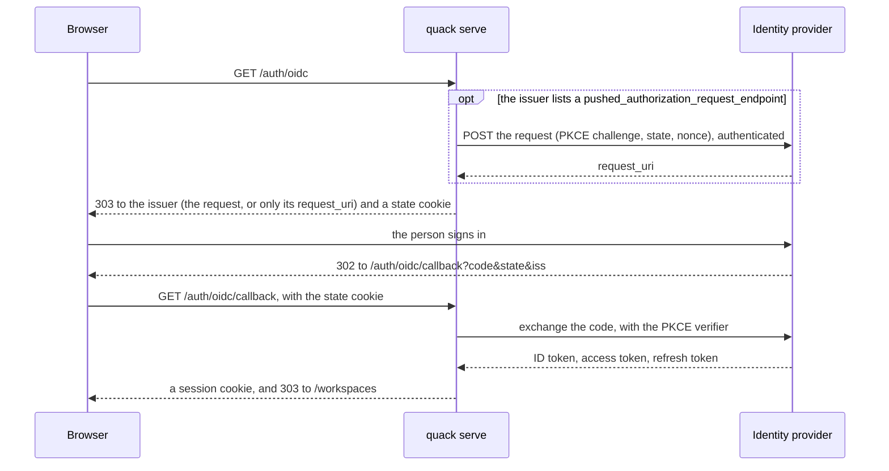

# Authentication

quack proves identity in two directions. Inbound, people and programs prove who they are to
`quack serve` (`[server]`, `[server.oidc]`). Outbound, quack proves to each model provider
(`[providers.NAME]`) who is calling: quack itself, or the person who made the request. The
two can share one identity provider; neither requires the other. Design doc sections 10.2 and
12 record the reasoning; [`crypto.md`](crypto.md) covers the cryptography.

## Terms

| Term | Meaning |
|---|---|
| Identity provider, issuer | The organization's sign-in service, such as Microsoft Entra ID, Okta, or Auth0. It issues tokens. |
| OAuth 2.0 | The standard protocol for issuing access tokens. |
| OpenID Connect (OIDC) | A sign-in layer on OAuth 2.0 that adds the ID token. |
| Access token | A short-lived credential that lets its holder call an API (application programming interface). |
| ID token | A signed statement of who signed in, for the application the person signed in to. |
| Refresh token | A longer-lived credential that obtains new access tokens without a new sign-in. |
| Bearer | A token sent in the HTTP (Hypertext Transfer Protocol) `Authorization: Bearer` header; whoever holds it can use it. |
| JWT (JSON Web Token) | A signed token format with readable claims such as `iss` (issuer), `sub` (subject), `aud` (audience), and `exp` (expiry). |
| JWKS (JSON Web Key Set) | The public keys an issuer publishes at its `jwks_uri` so others can check its JWT signatures. |
| PKCE (Proof Key for Code Exchange) | A secret the client proves at the token endpoint, so a stolen sign-in code is useless. |
| PAR (Pushed Authorization Request) | The client sends its sign-in request straight to the issuer and the browser carries only a reference to it (RFC 9126). |
| DCR (Dynamic Client Registration) | A client registers itself with the issuer over HTTP (RFC 7591), and later reads, updates, or deletes that registration (RFC 7592). |
| Client assertion, `private_key_jwt` | A short-lived JWT the client signs with its own private key to authenticate at the token endpoint, in place of a shared secret (RFC 7523). |
| OBO (on behalf of) | quack exchanges a signed-in person's token for a token to a model provider, so the provider sees the person rather than quack. |
| MCP (Model Context Protocol) | The protocol that AI clients such as Claude Code use to call tools; quack serves it at `/mcp/v1/{workspace}`. |
| RFC (Request for Comments) | A standard from the Internet Engineering Task Force, cited here by number. |
| HPKE (Hybrid Public Key Encryption) | The encryption scheme the vault uses for stored tokens (RFC 9180). |
| DPoP (Demonstrating Proof of Possession) | A scheme that binds a token to a key its client holds (RFC 9449). |
| SigV4 | The AWS (Amazon Web Services) request-signing scheme. |

| Direction | Mode | What the caller presents | How to turn it on |
|---|---|---|---|
| Inbound | Local | nothing (loopback only) | `quack serve --local`, or `[server].local = true` |
| Inbound | Password | a session cookie, or a `qs_…` bearer | `quack user add` |
| Inbound | API token | a `qk_…` bearer for one workspace | `quack token create` |
| Inbound | OpenID Connect sign-in | a session cookie | `[server.oidc]` |
| Inbound | Identity-provider access token | a JWT bearer | `[server.oidc].audience` |
| Outbound | None | nothing | `auth = "none"` (the default) |
| Outbound | API key | a static bearer from an environment variable | `auth = "api-key"` |
| Outbound | OAuth as quack | an access token quack obtains for itself | `auth = "oauth"` with a `grant` other than `on-behalf-of` |
| Outbound | OAuth on behalf of the person | an access token issued for the person who made the request | `grant = "on-behalf-of"` |
| Outbound | AWS | a SigV4 signature from the AWS credential chain | `type = "bedrock"` or `"bedrock-mantle"` |

## Inbound: proving identity to quack

### Which interfaces authenticate

Only `quack serve` authenticates callers. The terminal session, print mode (`-p` and `-q`),
`quack ingest`, and `quack mcp` on stdio run as the operating-system user who starts them,
unaudited in `control.db`. Anyone who can run the binary against a data directory can read
all of it, so quack creates that directory with mode `0700` and `quack doctor` warns when
other users can read it.

`quack serve --local` turns authentication off, for one person's own browser. One implicit
owner holds every workspace, and the server refuses to bind any address but loopback.

### How `quack serve` decides who is calling

One extractor, `server::auth`, handles every request to the REST API, the MCP endpoint, and
the web user interface (UI). It takes the bearer from the `Authorization: Bearer` header, else
the `quack_session` cookie, and tries three kinds of credential in order:

1. A session (`qs_…`), which a password login or an OpenID Connect sign-in opened.
2. An identity-provider access token, when `[server.oidc].audience` is set and the bearer
   has the three dot-separated parts of a JWT.
3. An API token (`qk_…`).

A request that matches none gets `401`, which also names where to obtain a token when quack
acts as a protected resource (below). Web pages redirect to `/login` instead.

Workspace membership, not the kind of credential, decides what a caller may do. Each member
holds one role per workspace: `viewer`, `member`, or `owner`. The server-wide admin flag
manages users, workspaces, and membership, never workspace content. An API token also carries
scopes (`read`, `write`, `admin`) and works in one workspace only. Every request that touches
a workspace, denied ones included, writes an access row to `control.db`'s `audit_log` and a
detail row in that workspace's own file (design doc 12).

### Passwords and sessions

```bash
quack user add alice            # prompts for the password; reads stdin when it is not a terminal
quack user add admin --admin
```

quack hashes passwords with argon2id. The web form (`POST /login`) and the API
(`POST /api/v1/auth/login`) both check the password and open a session: `qs_` followed by 32
random bytes, held in memory only, so a restart signs every user out. `POST /logout` (web) and
`POST /api/v1/auth/logout` (API) end a session. So does 12 hours after login
(`[server].session_max_age_hours`) or 120 minutes after its last request
(`[server].session_idle_minutes`), whichever comes first.

The session cookie carries `HttpOnly`, `SameSite=Lax`, `Path=/`, and, unless the request came
from loopback, `Secure`. A same-host TLS-terminating proxy also connects over loopback, so
there the cookie keeps `Secure` when `[server.oidc].redirect_uri` is https or
`[server].secure_cookies = "always"` (default `"auto"`). Set `"always"` behind a same-host
https proxy without `[server.oidc]`. quack ignores `X-Forwarded-Proto` here, since any client
can send it. The `[server.oidc]` sign-in state cookie follows the same rule.

The two login routes allow 2 requests per second per peer address, bursting to 10, on top of
the per-address server-wide limit. Neither limit reads the `Authorization` header, so changing
it buys no fresh budget.

### API tokens

```bash
quack token create -w sales --user alice --name reporting --scopes read,write --expires 90
quack token list -w sales
quack token revoke -w sales HASH          # a prefix of the hash is enough
```

An API token is `qk_` followed by 32 random bytes. quack shows it once and stores only its
SHA-256 hash. It acts as its user in one workspace, limited to its scopes. quack refuses and
audits an expired or revoked token. Workspace owners can also create and revoke tokens on the
workspace's Settings page.

### Sign-in through the organization's identity provider

With `[server.oidc]` set, the login page offers "Sign in with *issuer host*" above the
password form, which keeps working.

```toml
[server.oidc]
issuer_url = "https://login.example.com"                      # quack reads its /.well-known/openid-configuration
client_id = "quack"
client_secret_env = "QUACK_OIDC_SECRET"                       # when the issuer registers quack as a confidential client
# client_auth = "private_key_jwt"                             # sign with quack's own key; no secret
redirect_uri = "https://quack.example.com/auth/oidc/callback" # this server's own URL; register it with the issuer
# scopes = ["openid", "profile", "email", "offline_access"]   # the default; "openid" is required
# subject_claim = "sub"                                       # set "oid" for Entra ID
```


```mermaid
sequenceDiagram
    participant B as Browser
    participant Q as quack serve
    participant I as Identity provider
    B->>Q: GET /auth/oidc
    opt the issuer lists a pushed_authorization_request_endpoint
        Q->>I: POST the request (PKCE challenge, state, nonce), authenticated
        I-->>Q: request_uri
    end
    Q-->>B: 303 to the issuer (the request, or only its request_uri) and a state cookie
    B->>I: the person signs in
    I-->>B: 302 to /auth/oidc/callback?code&state&iss
    B->>Q: GET /auth/oidc/callback, with the state cookie
    Q->>I: exchange the code, with the PKCE verifier
    I-->>Q: ID token, access token, refresh token
    Q-->>B: a session cookie, and 303 to /workspaces
```

If discovery lists a `pushed_authorization_request_endpoint`, quack pushes the sign-in
request there first (RFC 9126), authenticated as at the token endpoint. The browser then
carries only `client_id` and the returned `request_uri`, so nobody can read or alter the PKCE
challenge, `state`, `nonce`, or redirect in transit. Otherwise the browser carries the
request itself. A provider's `authorization-code` login works the same way.

quack binds the callback to the browser that started the sign-in: it compares the callback's
`state` with a cookie set on that browser at the start. A callback link someone else started
therefore cannot sign this browser in. A pending sign-in expires after 10 minutes, each
`state` works once, and at most 10,000 are pending at a time. An `iss` parameter on the
redirect must name the configured issuer, and an issuer that advertises
`authorization_response_iss_parameter_supported` must always send it (RFC 9207). This stops
one server's response from passing as another's.

The ID token arrives from the token endpoint over TLS (Transport Layer Security), which
OpenID Connect Core 3.1.3.7 accepts in place of a signature check. quack checks four claims
instead: `iss` matches the discovery document; `aud` and `azp` name quack's client; `exp` has
not passed, with 60 seconds of leeway; and `nonce` equals the value quack sent.

`subject_claim` (default `sub`) names the claim that identifies the person; Entra deployments
set `oid` ([Provider notes](#provider-notes)). A first sign-in creates a user with no
password, no admin flag, and no memberships, who sees nothing until an owner adds them. The
username comes from `preferred_username`, then `email`, then the subject, with a suffix if
taken, so a sign-in never takes over an existing account by name.

quack keeps the person's tokens, refresh token included, sealed in `control.db`, and renews
the access token on the first request or on-behalf-of exchange near its expiry (a background
job's included). If the issuer refuses (revoked grant, disabled account), all the person's
sessions end at once, the stored token and any access token they presented are dropped, and
provider tokens exchanged for them are not reused. If it is unreachable, quack retries after
60 seconds and the session continues. Without a refresh token (no `offline_access`), only
quack's 12-hour and 120-minute limits apply. Logging out of the last session deletes the
stored tokens. `control.db`'s audit log records each sign-in as `login`, and each one the
issuer ended as one denied `session`, with the address and request id of the request (or of
the request that submitted the job) that met the refusal.

### Access tokens from the identity provider (quack as a protected resource)

With `audience` set, the API and MCP also accept access tokens the identity provider issues
for quack. A script or an MCP client such as Claude Code then uses a token it already holds
instead of a quack API token.

```toml
[server.oidc]
# ...as above
audience = "api://quack"   # the aud of access tokens for quack; see the provider notes
```

quack verifies each token with `jsonwebtoken` on aws-lc-rs against the issuer's `jwks_uri`
keys, cached for one hour. An unknown key triggers at most one refetch a minute: enough for
key rotation, too few for invalid tokens to flood the issuer. quack accepts asymmetric
signature algorithms only, and requires:

- `iss` to be the issuer and `aud` the configured audience;
- `exp` in the future, with 60 seconds of leeway;
- a `scp` or `scope` claim. An ID token can carry the same `aud` as an access token but
  carries no scope, so this rule refuses ID tokens.

Like a sign-in, the token maps to its user through `subject_claim`, so one person is one
quack user however they arrive. A new person gets a user with no access; the token then
carries that user's memberships. A refused token gets `401` and a denied `token` audit row.

quack publishes where to obtain such a token as OAuth 2.0 Protected Resource Metadata
(RFC 9728):

| Path | Describes |
|---|---|
| `/.well-known/oauth-protected-resource` | the server |
| `/.well-known/oauth-protected-resource/api/v1` | the REST API |
| `/.well-known/oauth-protected-resource/mcp/v1/{workspace}` | one MCP endpoint |

Each document names the issuer in `authorization_servers`. Every `401` from the API or MCP
points to the matching document:

```http
HTTP/1.1 401 Unauthorized
WWW-Authenticate: Bearer resource_metadata="https://quack.example.com/.well-known/oauth-protected-resource/mcp/v1/sales"
```

When quack refused a presented credential, the challenge adds
`error="invalid_token"`. This is the discovery the MCP authorization specification expects:
an MCP client pointed at `https://quack.example.com/mcp/v1/sales` without a token reads the
metadata, signs the user in with the issuer, and retries with the access token. Without
`audience`, quack publishes nothing and treats a JWT bearer as an unknown API token.

## Outbound: proving identity to model providers

Each `[providers.NAME]` entry chooses an `auth` mode.

### No authentication and API keys

```toml
[providers.ollama]
type = "ollama"                 # auth = "none" is the default

[providers.anthropic]
type = "anthropic"
auth = "api-key"
api_key_env = "ANTHROPIC_API_KEY"
```

quack reads an API key from the named environment variable, sends it as the bearer, and
stores nothing.

### OAuth as quack

With `auth = "oauth"`, quack obtains an access token and sends it as the bearer, for an
endpoint behind an identity provider such as Azure OpenAI with Entra ID or an internal
gateway. `grant` decides how:

| `grant` | Who signs in | How the token renews |
|---|---|---|
| `authorization-code` (the default) | A person, in a browser. quack runs PKCE and catches the redirect on a loopback listener at `redirect_uri`. | With the refresh token, without a new sign-in. |
| `device-code` | A person, who enters a code on another device (for SSH sessions, or hosts without a browser). | With the refresh token, without a new sign-in. |
| `client-credentials` | Nobody. quack authenticates as itself with `client_id` and the secret in `client_secret_env`, or its key (`private_key_jwt`). | quack runs the grant again. |

```toml
[providers.azure]
type = "openai"
base_url = "https://{resource}.openai.azure.com/openai/deployments/{deployment}"
auth = "oauth"

[providers.azure.oauth]
issuer_url = "https://login.microsoftonline.com/{tenant_id}/v2.0"
client_id = "..."
scopes = ["https://cognitiveservices.azure.com/.default", "offline_access"]
# grant = "authorization-code"                  # or "device-code", "client-credentials", "on-behalf-of"
# client_secret_env = "AZURE_CLIENT_SECRET"      # client-credentials and on-behalf-of need it or a key
# client_auth = "client_secret_post"             # or "client_secret_basic", or "private_key_jwt"
# redirect_uri = "http://127.0.0.1:19876/callback"
```

```bash
quack auth login azure      # a browser, or a device code when no browser can open; --device-code forces it
quack auth status           # each OAuth provider: when its token expires, how it renews, where the key is
quack auth logout azure
```

quack reuses a token while more than 60 seconds remain, then renews it under one lock that
concurrent requests share. When a person must sign in but cannot (a server, or print mode),
quack fails with "needs a login; run `quack auth login NAME`": the command-line interface
(CLI) exits with code 4 and the server answers `503`. A `client-credentials` provider needs no
login: its first request obtains a token, and `quack auth login` only checks the credentials.
The token is sealed in `control.db` (`provider_tokens`), so one login serves every later
process on that data directory, `quack serve` included.

The renewal lock covers one process. Two processes on one data directory, such as `quack
serve` and a `quack -p` beside it, can both refresh an expiring token. An issuer that rotates
refresh tokens returns a new one on each refresh and refuses the old, so the second refresh
fails. quack then rereads the stored token and uses it if another process stored a
different, unexpired one meanwhile. That fails with reuse detection, as in Okta's and Auth0's
refresh token rotation: the issuer treats the reuse as theft and revokes the whole token
family, including the token the first process just stored, and every process needs `quack
auth login` again. With such an issuer, make the model calls through one long-lived process,
such as `quack serve`.

`client_auth` sets how quack authenticates at the token endpoint, for every grant and for
`[server.oidc]`:

| `client_auth` | What quack sends |
|---|---|
| `client_secret_post` (the default) | the secret in the request body; Entra ID and Auth0 accept it |
| `client_secret_basic` | the secret in an HTTP Basic header; Okta applications use it by default |
| `private_key_jwt` | a signed assertion and no secret (next section) |

With neither a secret nor `private_key_jwt`, quack is a public client and sends only its
`client_id`.

### Client authentication with a key (`private_key_jwt`)

With `client_auth = "private_key_jwt"`, quack authenticates with a private key that never
leaves it. The issuer holds only the public half, and no shared secret is copied into quack's
environment. On every token-endpoint request and pushed authorization request, quack signs a
new client assertion (RFC 7523 section 2.2) and sends it as `client_assertion`, with
`client_assertion_type` set to `urn:ietf:params:oauth:client-assertion-type:jwt-bearer` and
its `client_id`. It sends no `client_secret` and no HTTP Basic header.

The assertion is a JWT signed with ES256 (the elliptic-curve signature on P-256 with
SHA-256). Its header names the key by `kid`, the key's RFC 7638 thumbprint. Its claims are:

| Claim | Value |
|---|---|
| `iss`, `sub` | the `client_id` |
| `aud` | the issuer identifier from discovery, else the configured `issuer_url` |
| `jti` | a new UUID v7 |
| `iat`, `exp` | now, and one minute later |

The issuer refuses a reused `jti`, so quack signs every request anew, device-code polls and
retries included. quack refuses a configuration that also sets `client_secret_env`. The key
is a client credential, so the `client-credentials` and `on-behalf-of` grants accept it in
place of a secret.

```bash
quack auth jwks gateway     # the public key set of [providers.gateway.oauth]'s client
quack auth jwks             # the public key set of the [server.oidc] sign-in client
```

`quack auth jwks` prints the public key as a JWK set, ready for the issuer's client
registration (its `jwks` field):

```json
{
  "keys": [
    {
      "kty": "EC",
      "crv": "P-256",
      "x": "…",
      "y": "…",
      "kid": "…the RFC 7638 thumbprint…",
      "use": "sig",
      "alg": "ES256"
    }
  ]
}
```

quack makes the key with aws-lc-rs on first use (`quack auth jwks` or a request) and keeps it
vault-sealed in `control.db` (table `client_keys`). The key's name is its client's: the
issuer without a trailing slash, then the `client_id`. So `[server.oidc]` and a provider
using the same client at the same issuer share one key and one registration. An unregistered
client has no `client_id`; its key waits under the issuer's name alone until registration
moves it ([Registering the client from quack](#registering-the-client-from-quack)). Each
process loads the key once. `quack auth status` shows its thumbprint for every
`private_key_jwt` client.

Rotation takes two steps. At each, quack sends the key set to the issuer for a client it
registered (RFC 7592), or prints it for a client registered by hand, to replace the set in
the issuer's console.

```bash
quack auth jwks --rotate gateway              # a new key beside the one in use
quack auth jwks --rotate --activate gateway   # sign with the new key; the issuer holds it alone
```

Leave out the provider name for the `[server.oidc]` client, as with `quack auth jwks`.

1. `--rotate` stores a new key in `client_keys` under its replacement name,
   `next <issuer> <client_id>`, and gives the issuer the key in use plus the new one. quack
   keeps signing with the key in use. Repeating `--rotate` sends or prints the same pair
   without making another key. `quack auth status` shows the replacement waiting.
2. Once the issuer holds both, `--rotate --activate` swaps in the new key and deletes the old
   one in one transaction, and gives the issuer the new key alone. Restart every running
   `quack serve` right after (for a client registered by hand, before pasting): each loaded
   the old key once, and the issuer no longer accepts it. Repeating `--activate` sends or
   prints the key in use alone, so a failed update can be retried.

If the vault key is lost, quack cannot open the stored key. It makes a new key on its next
request and logs a warning to register the new public key (`quack auth jwks`). Until then the
issuer refuses quack's assertions with `invalid_client`.

quack reads the issuer's endpoints from `{issuer_url}/.well-known/openid-configuration`, or,
if that does not exist, from the OAuth 2.0 Authorization Server Metadata of RFC 8414, at
`/.well-known/oauth-authorization-server` placed before the issuer's path. Either document
must name the configured issuer, and the browser flow's redirect must pass the RFC 9207 check
described for sign-in.

### Registering the client from quack

`quack auth register` creates a `private_key_jwt` client by posting its metadata to the
`registration_endpoint` in the issuer's discovery document (Dynamic Client Registration, RFC
7591), so nobody copies a key into a console or a `client_id` back into the file. The answer
carries the new `client_id`, and usually a `registration_access_token` and a
`registration_client_uri` to read, update, or delete the registration later (RFC 7592).

Leave `client_id` out of every section the registered client should serve, and set
`client_auth = "private_key_jwt"` in each; quack refuses a section with neither a
`client_id` nor a key. One registration serves every such section at one issuer, so
`[server.oidc]` and an on-behalf-of provider share the client.

```bash
quack auth register                         # sign in, then register as yours
quack auth register --device-code           # sign in with a device code (no browser)
quack auth register --token-env IDP_TOKEN   # register with an access token as the bearer
quack auth register --open                  # register with no token: anyone may sign in
quack auth register --print                 # the request as JSON, sent nowhere
quack auth register --replace               # register a new client, then delete the old one
quack auth jwks --rotate                    # a new key beside the old, sent to the issuer
quack auth unregister                       # delete the client at the issuer, then locally
```

`quack auth register` finds the issuer itself when all the sections without a `client_id`
share one; with several, name one with `--issuer`. It then makes the client's key and builds
the request from the configuration:

| Field | Value |
|---|---|
| `grant_types` | `authorization_code` for sign-in and for a provider's browser login; the device-code grant; the token-exchange grant for `on-behalf-of`; `client_credentials` for a provider with that grant, or for an on-behalf-of provider with `actor = true`; `refresh_token` when a section's scopes include `offline_access` |
| `response_types` | `["code"]` when `authorization_code` is among the grants |
| `redirect_uris` | `[server.oidc].redirect_uri`, or a provider's loopback `redirect_uri` |
| `application_type` | `web` with the sign-in callback, `native` with a loopback redirect alone |
| `token_endpoint_auth_method` | `private_key_jwt`, signing with ES256, and `jwks` holding the key |
| `scope` | every scope the sections ask for |
| `client_name` | `--name`, `quack` by default |

The request never asks for `dpop_bound_access_tokens` or
`tls_client_certificate_bound_access_tokens`: a bound token needs a proof on every request,
which model APIs cannot take. A provider that logs in through the loopback listener cannot
share a registration with the `[server.oidc]` callback: OpenID Connect Dynamic Client
Registration 1.0 section 2 lets a native client register only custom-scheme or loopback
redirects, and lets an issuer reject an `http` redirect on any other client. quack refuses
that combination and names the provider, which then needs its own `client_id`.

What authorizes the registration decides who owns the client:

- **Signing in** (the default; `--device-code` forces the device-code flow). An issuer that
  makes the registration's bearer the client's owner needs the person's own token, which
  people rarely have to hand. quack registers a temporary public client (a native app with no
  secret, PKCE, and a loopback redirect on a free port) and signs the person in through it,
  in the browser or with a device code over SSH. It registers the real client with that
  token, stores the token nowhere, then deletes the temporary client (RFC 7592), ending that
  sign-in. Until then, anyone with an account at the issuer can sign in to it, so quack keeps
  its record sealed in `control.db`. After an interrupted run (Ctrl-C deletes it on the way
  out) or a refused delete, the next `quack auth register` deletes it first, and `quack
  doctor` names it meanwhile.
- **An access token** (`--token-env VAR`): the environment variable holds the bearer, such
  as the initial access token some issuers require.
- **Nothing** (`--open`). quack warns that an open registration may create a client anyone
  with an account at the issuer can use, and asks first; `--yes` answers for it.

Without `--token-env` or `--open`, quack signs the person in only if discovery advertises a
`registration_endpoint`, `none` in `token_endpoint_auth_methods_supported` (the temporary
client is public), and `S256` in `code_challenge_methods_supported`. RFC 8414 section 2 makes
`client_secret_basic` the default when the first list is omitted, and says of the second:
"If omitted, the authorization server does not support PKCE." quack refuses an issuer lacking
any of them, naming what is missing and the other two choices. It never registers an open
client unasked, since that client could be every user's. Vouch advertises all three, on
`vouch.sh` or its own domain.

quack stores the result in `control.db`, table `client_registrations`, under the issuer's
name: the `client_id`, the `registration_client_uri`, and the vault-sealed
`registration_access_token`. The same transaction renames the key from the issuer's name to
`<issuer> <client_id>`. Every section without a `client_id` reads it from there, and `quack
config` shows its origin as `registration`. If such a section's issuer has no registration,
`quack serve` refuses to start and other commands fail on first use, naming `quack auth
register`. Writing the registered `client_id` into the file also works; quack still manages
the client, since the id matches the registration.

`--replace` registers and keeps a new client with a new key before deleting the old one at
the issuer (an RFC 7592 `DELETE` with its registration access token), so a failure never
leaves quack without a client. quack reports a refused delete, which leaves the old client in
place; one the issuer no longer knows is already gone. Anything else configured with the old
`client_id` stops working.

Two registrations at one issuer never overwrite each other's record: the one that keeps its
client second deletes that client at the issuer and stops.

A registered client's key rotates as in [Client authentication with a
key](#client-authentication-with-a-key-private_key_jwt). Each update reads the registration
(RFC 7592 `GET`) and sends all of it back with the new `jwks` and the `client_id` (RFC 7592
`PUT`), since an update replaces every field the issuer holds. quack keeps any new
registration access token the issuer returns.

`quack auth unregister` deletes the client at the issuer, then the registration and the key.
`quack doctor` checks that every section without a `client_id` has a registration and, unless
`--offline`, that the issuer still describes the client at its `registration_client_uri`.

For a client registered by hand, put the issuer's `client_id` in each section, run `quack
auth jwks`, and register the printed key set ([Without registration: create the client in the
console](#without-registration-create-the-client-in-the-console)). quack records no such
client and holds no registration access token for it, so its key rotates by hand.

Issuer support for registration:

- Vouch accepts it, open or with a signed-in person's token (see [Recommended: on behalf of
  each person, with Vouch](#recommended-on-behalf-of-each-person-with-vouch)).
- Auth0 accepts it once Dynamic Client Registration is turned on for the tenant.
- Okta accepts it with an initial access token or an API token as the bearer (`--token-env`).
- Microsoft Entra ID does not offer RFC 7591: register the client in the Azure portal and set
  `client_id`.

An issuer that returns no registration access token leaves quack unable to rotate or delete
the client; quack says so when it registers one.

### OAuth on behalf of the person

With `grant = "on-behalf-of"`, each request reaches the provider as the person who made it,
so the model API's own logs, quotas, and access policies see individual users. This grant
works only in `quack serve`.

```toml
[providers.gateway.oauth]
issuer_url = "https://login.example.com"
client_id = "quack"
client_secret_env = "GATEWAY_SECRET"   # or client_auth = "private_key_jwt"; one is required
grant = "on-behalf-of"
exchange = "token-exchange"            # or "entra"
audience = "api://model-gateway"       # RFC 8693 audience (Okta, Auth0)
# resource = "https://model.example.com"   # RFC 8707 resource, when the issuer uses it
# actor = true                            # the default: send quack's own token as the actor
# scopes = ["model.use"]
```

For each request, quack exchanges the person's access token for quack at the issuer for a
token to the provider. The person's token is their stored sign-in, renewed when due, or else
the identity-provider access token they presented as a bearer. quack caches each exchanged
token in memory until 60 seconds before it expires.

`exchange` chooses the request format:

- `token-exchange`, the default, is OAuth 2.0 Token Exchange (RFC 8693), which Okta, Auth0,
  and Vouch implement. quack sends the person's token as `subject_token` of type
  `access_token`, asks for an access token back (`requested_token_type`), and adds `scope`,
  `audience`, and `resource` when set. quack also sends its own client-credentials token as
  `actor_token`, so the issued token names the person as its subject (`sub`) and quack as the
  party acting for them (`act`). `actor = false` omits the actor token for an issuer that
  does not accept one, such as Vouch (see [Why each setting](#why-each-setting)).
- `entra` is Microsoft Entra ID's On-Behalf-Of flow: the `jwt-bearer` grant with the
  person's token as `assertion` and `requested_token_use=on_behalf_of`. Entra's flow has no
  actor token, so quack ignores `actor`.

Whom a request acts for:

- A request to `quack serve` acts for its authenticated caller.
- A background job, such as the embeddings an upload triggers, acts for the user who
  submitted it, even when it runs hours later.
- An MCP `query` or `search` acts for the user of that MCP connection.

quack refuses a request with no signed-in person behind it (the CLI, the terminal, local
mode), or whose person has no current identity-provider token (such as a password user who
never signed in through the issuer). The refusal names the provider and the reason: `403`
from the server, exit code 4 from the CLI. quack never sends such a request as itself.

`quack auth login` has nothing to do for this grant and says so; `quack auth status` reports
the grant. `quack doctor` checks that the issuer's `grant_types_supported`, when listed,
includes the configured exchange, and with `actor = true` that quack can obtain its own
client-credentials token (the actor). With `actor = false`, quack never runs the
client-credentials grant for the provider, and `quack doctor` requests no token at all.

### AWS (Bedrock)

`bedrock` and `bedrock-mantle` providers sign requests with the default credential chain of
the AWS SDK (software development kit), the chain the AWS CLI uses. It checks, in order:

1. environment variables;
2. the profile named by `aws_profile` (else `AWS_PROFILE`, else `default`), with its
   `role_arn`, `source_profile`, `credential_process`, and IAM (Identity and Access
   Management) Identity Center (`aws sso login`) settings;
3. web identity on EKS (Elastic Kubernetes Service);
4. the instance roles of ECS (Elastic Container Service) and EC2 (Elastic Compute Cloud).

quack stores nothing; the SDK caches and refreshes the credentials. Design doc 10.2 has the
details.

## Recommended: on behalf of each person, with Vouch

Copy this setup to reach a model provider as each person, with [Vouch](https://vouch.sh) as
the issuer. One confidential client serves both the sign-in to `quack serve` and the token
exchange.

### Configure quack

The client authenticates with a key quack holds (`private_key_jwt`), so there is no shared
secret. Leave `client_id` out: `quack auth register` fills it in.

```toml
[server.oidc]
issuer_url = "https://us.vouch.sh"
client_auth = "private_key_jwt"
redirect_uri = "https://quack.example.com/auth/oidc/callback"
scopes = ["openid", "email"]

[providers.gateway]
type = "openai"
base_url = "https://models.example.com/v1"
auth = "oauth"

[providers.gateway.oauth]
issuer_url = "https://us.vouch.sh"
client_auth = "private_key_jwt"
grant = "on-behalf-of"
exchange = "token-exchange"
actor = false
# audience = "https://models.example.com"   # when the model API expects one
```

Both sections name the same issuer and set neither `client_id` nor `client_secret_env`, so
one registration and one key serve both.

### Register the client

```bash
quack auth register
```

quack signs you in to Vouch through a temporary public client it deletes afterwards (in the
browser; with a device code over SSH or with `--device-code`), registers the client as yours,
and prints its client ID. It registers exactly what the two sections need: the sign-in
callback, the `authorization_code` and token-exchange grants, `private_key_jwt` with quack's
key, and neither DPoP nor mTLS binding.

Vouch records you as the owner, with access scope Personal, so only you can sign in until you
widen it. On your Applications page in the Vouch console (`https://us.vouch.sh/applications`),
set **Access scope** to **Organization** and save. This step is deliberately manual: RFC 7591 has no field for it, and it decides who in your
organization can use quack.

### Start it

```bash
quack user add admin --admin    # Vouch sign-ins start with no access
quack doctor                    # checks the client and the token exchange
quack serve
```

Each person clicks "Sign in with us.vouch.sh" on the login page. An owner then gives them
workspaces with `quack member add` or on the workspace's Settings page.

### Why each setting

- **PKCE**: only quack knows the verifier, so a stolen authorization code is useless.
- **PAR**: Vouch's discovery lists `https://us.vouch.sh/oauth/par`, so quack pushes the
  sign-in request there and keeps it off the browser.
- **`private_key_jwt`**: only the key's holder can turn a person's Vouch token into a model
  API token, and there is no shared secret to copy, store, or leak.
- **Standard profile, not FAPI 2.0**: a FAPI client must send a DPoP proof or a TLS client
  certificate with every token request, so Vouch binds its tokens to a key. The model API
  behind an on-behalf-of provider takes bearer tokens and cannot use them.
- **`actor = false`** is required: Vouch accepts an actor token only from a Vouch user, and
  quack's token names a client, so Vouch would refuse the exchange with "Actor token user not
  found". The issued token still names the person as its subject and records quack's
  `client_id`.

Vouch offers only the `openid` and `email` scopes and issues no refresh tokens, so a sign-in
lasts for Vouch's session. Its exchange accepts only Vouch-issued subject tokens, so each
person must have signed in to quack through Vouch.

### Rotate the key

quack updates Vouch at each of the two steps (RFC 7592):

```bash
quack auth jwks --rotate              # Vouch holds the key in use and a new one
quack auth jwks --rotate --activate   # quack signs with the new one, which Vouch holds alone
```

Restart `quack serve` right after `--activate`: until then it signs with the old key, which
Vouch no longer accepts.

### Without registration: create the client in the console

1. Configure quack as above, still without a `client_id`, and print the key made for the
   client:

   ```bash
   quack auth jwks
   ```

2. In the Vouch console, create an application with these settings:

   | Setting | Value |
   |---|---|
   | Application type | Web |
   | Redirect URI | `https://quack.example.com/auth/oidc/callback` (your server's public URL) |
   | Access scope | Organization |
   | Security profile | Standard OAuth |
   | Client authentication | Private key (`private_key_jwt`) |
   | JWKS | the output of `quack auth jwks` |

   Vouch issues no client secret for it.

3. Add `client_id = "CLIENT_ID"` (from the console) to both sections, print the key quack
   makes for that client, and paste it into the application's JWKS, replacing step 1's:

   ```bash
   quack auth jwks
   ```

quack did not register this client, so it cannot update it at Vouch. Rotate its key with
`quack auth jwks --rotate`, then `--rotate --activate`, pasting each key set it prints into
the application's JWKS ([Client authentication with a
key](#client-authentication-with-a-key-private_key_jwt)).

### With a client secret instead

A Vouch console with no Client authentication choice gives a non-FAPI Web application a
client secret only. Copy the client ID and the secret (shown once), export the secret, and in
both sections add `client_id` and replace `client_auth = "private_key_jwt"` with:

```toml
client_secret_env = "VOUCH_CLIENT_SECRET"
client_auth = "client_secret_basic"
```

## One person on the command line

For one person using quack on their own machine, register a public client, with no secret
and no key, and use `grant = "authorization-code"`:

```toml
[providers.gateway.oauth]
issuer_url = "https://login.example.com"
client_id = "quack-cli"
grant = "authorization-code"                    # the default
# redirect_uri = "http://127.0.0.1:19876/callback"
```

`quack auth login gateway` opens the browser, catches the redirect on a loopback listener,
and protects the code with PKCE. Register the loopback `redirect_uri` with the issuer. A
secret or key adds nothing where the person can read it anyway.

Use `device-code` only on a headless machine, such as one reached over SSH. A device code can
be phished: an attacker starts a login, sends the victim the code, and receives the victim's
token on approval. The browser flow sends the token only to the listener that started the
login.

## Where quack keeps secrets

| Secret | Location | Protection |
|---|---|---|
| The vault key (an HPKE P-256 key pair) | OS keychain entry `quack` / `vault`; `<data_dir>/vault.key` where no keychain works | the keychain, or file mode `0600` |
| Signed-in users' identity-provider tokens | `control.db`, table `user_tokens`, deleted with the user | sealed by the vault |
| Providers' OAuth tokens | `control.db`, table `provider_tokens` | sealed by the vault |
| Client keys for `private_key_jwt` (P-256, PKCS#8) | `control.db`, table `client_keys` | sealed by the vault |
| Exchanged on-behalf-of tokens | memory only | lost on restart, and exchanged again on demand |
| Passwords | `control.db`, `users.password_hash` | argon2id |
| API tokens | `control.db`, `api_tokens.token_hash` | the SHA-256 of a 32-byte random token |
| Sessions | memory only | lost on restart |
| Client secrets and API keys | the environment variables the config names | the process environment |
| AWS credentials | the AWS SDK's own locations | the SDK |

The vault seals each value with HPKE, suite DHKEM(P-256, HKDF-SHA256), HKDF-SHA256,
AES-256-GCM: a P-256 elliptic-curve key exchange, a SHA-256 key derivation, and authenticated
AES-256 encryption. It binds each value to its purpose and owner, so a sealed row copied to
another user or provider fails to open. The vault key never sits in the database it protects.

quack looks for the vault key in the keychain, then in `vault.key`, and `quack auth status`
reports the location in that order. quack writes `vault.key` only when the host has no usable
keychain: none can be installed, or no entry can be addressed (as under Docker's seccomp
profile). A keychain that exists but refuses access (locked, or quack denied) is an error
naming the keychain, never a fallback to the file. The keychain may hold the key that sealed
the stored tokens, which would not open under a new key; and tokens sealed under a new key in
`vault.key` would not open once the keychain answered again, since it comes first. Either way
people would sign in again. Unlock the keychain, or grant quack access, and retry.

quack makes the vault key while holding an exclusive lock on `<data_dir>/vault.key.lock`, so
two quack processes that start at once on one data directory agree on one key. The keychain
entry is shared by every data directory of one OS user, and processes on different data
directories do not share that lock: start one quack against a new data directory first when
several will share a keychain.

Operational consequences:

- Linux keeps the kernel keyring in memory, so a reboot loses the vault key: users sign in
  again, and each OAuth provider needs `quack auth login` again.
- Docker's default seccomp profile (the system-call filter on containers) blocks the keyring,
  so in a container quack writes the key to `vault.key` on the data volume.
- A backup of `control.db` without the vault key cannot open the tokens in it, by design.
  Restore the key with the database, or plan for every user to sign in again.

## Provider notes

These settings come from each vendor's documentation as of September 2026. quack has not yet
been tested against a live tenant of any of them.

**Microsoft Entra ID.** Set `issuer_url` to
`https://login.microsoftonline.com/{tenant_id}/v2.0`. Register
`https://<server>/auth/oidc/callback` as a Web redirect URI, create a client secret for
`client_secret_env`, and set `subject_claim = "oid"`: Entra gives one person a different
`sub` in each application. To accept access tokens, expose an API on the app registration.
Set `requestedAccessTokenVersion` to `2` in its manifest (older manifests:
`accessTokenAcceptedVersion`); version 1.0 tokens carry the non-matching issuer
`https://sts.windows.net/{tenant_id}/`. Set `audience` to the API's
client ID, a GUID (globally unique identifier): a version 2.0 token's `aud` is always the
client ID, never the Application ID URI. Entra access tokens carry `scp`. For on-behalf-of,
set `exchange = "entra"` and list the downstream API's scope, for example `scopes =
["https://cognitiveservices.azure.com/.default"]`. The person's token must be an access token
for quack's own API, so add that API's scope (for example
`api://<quack-client-id>/access_as_user`) to `[server.oidc].scopes`.

**Okta.** Use a custom authorization server, such as `https://{domain}/oauth2/default`; the
org authorization server issues access tokens only for Okta's own APIs. Enable the Refresh
Token grant on the application so `offline_access` returns a refresh token. Set `audience`
to the authorization server's Audience (`api://default` for `default`). Okta access tokens
carry `scp` as an array. For on-behalf-of, create an API Services application with the Token
Exchange grant, set `client_auth = "client_secret_basic"` to match Okta's default, and set
`audience` to the downstream authorization server's audience. Token exchange across two
authorization servers requires Okta's trusted servers, and an NHI (non-human identity)
subscription bought or renewed on or after August 14, 2026.

**Auth0.** Set `issuer_url` to `https://{tenant}.auth0.com/` or to your custom domain. Set
`audience` to the API's Identifier, and enable "Allow Offline Access" on the API for refresh
tokens. Auth0 issues a JWT access token only when the client asks for an audience, which
quack's own sign-in cannot do yet; a client that obtains its own token, such as an MCP
client, can use it with quack. For on-behalf-of, turn on On-Behalf-Of Token Exchange on
quack's own client (the one that performs the exchange) and set `audience` to the downstream
API's identifier.

**Vouch** ([vouch.sh](https://vouch.sh)). See
[Recommended: on behalf of each person, with Vouch](#recommended-on-behalf-of-each-person-with-vouch).

## Troubleshooting

`quack doctor` checks each configured piece:

- every model provider: the endpoint answers, the credential is accepted, the model is
  listed. An on-behalf-of provider is checked with quack's own actor token, not a user's, or
  with `actor = false` only for the issuer listing the exchange.
- `[server.oidc]`: the secret variable is set, the issuer answers discovery under its
  configured name, and, with `audience`, how many signing keys the issuer publishes.

`--offline` skips every network check. `quack config` lists every setting in force and where
each value came from.

Seven errors and their fixes:

- "provider 'X' needs a login" (exit 4, or `503` from the server). Run
  `quack auth login X` as the server's operating-system user, with the same data directory.
- "provider 'X' acts on behalf of the signed-in person and could not": the request came from
  the CLI, the terminal, local mode, or a user with no current identity-provider token. Sign
  in through the issuer, or use a provider that does not act on behalf of users.
- "access token refused: InvalidAudience": the token's `aud` differs from
  `[server.oidc].audience`. Decode the token (a JWT) and compare. For Entra ID, see
  [Provider notes](#provider-notes).
- "the discovery document for X names issuer …": `issuer_url` must match the issuer's own
  `issuer` value exactly, apart from a trailing slash.
- "the sign-in could not be matched to this browser": the state cookie was missing. The
  sign-in started in another browser or tab, or the browser used a host name other than
  `redirect_uri`'s.
- `invalid_client` with `client_auth = "private_key_jwt"`: the issuer does not have quack's
  current public key. Run `quack auth jwks` (with the provider name for a provider) and
  register its output; the log warns if the key was replaced. After `quack auth jwks --rotate
  --activate`, restart `quack serve`, which still signs with the old key.
- "the redirect names issuer …, not this one (RFC 9207)": the redirect came from a server
  other than the configured issuer. Check `issuer_url`, proxies, and mixed tenants.

## FAQ

**Can password users and signed-in users coexist?** Yes. Both logins open the same kind of
session. On-behalf-of providers serve only users with an identity-provider token.

**Do users need a quack API token to use MCP?** Not when `[server.oidc].audience` is set. An
MCP client can sign the user in with the identity provider and present that access token.

**What does the model provider see for a background job?** With `grant = "on-behalf-of"`, it
sees the user who submitted the job. With any other grant, it sees quack.

**Why does quack refuse instead of falling back to its own identity?** An on-behalf-of
provider expects individual users. Sending some requests as quack would silently corrupt its
logs, quotas, and access policies.

**Does quack support DPoP?** No; quack sends and accepts bearer tokens only. DPoP makes a
stolen token useless on its own, but a bound token needs a fresh proof on every request, so
a model API that accepts bearer tokens would refuse a bound on-behalf-of token. Issuers that
support DPoP, Vouch among them, still issue bearer tokens to a client that sends no proof, so
quack works with them unchanged. The `private_key_jwt` key authenticates quack to the issuer;
it binds no token.
